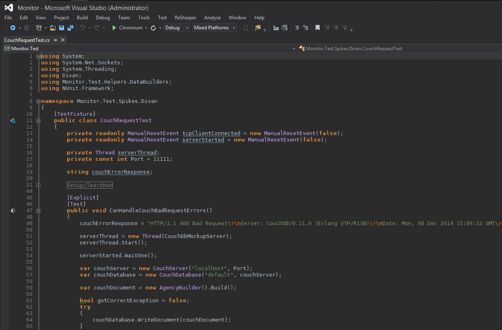

Niflheim theme for Visual Studio 2013
========================

A Niflheim theme for [Visual Studio 2013](http://www.visualstudio.com/).

## Installation

Double click on `Niflheim.vstheme`

It is recommended to use this theme with [DejaVu Sans Mono](http://dejavu-fonts.org/wiki/Download).
To change the font in Visaul Studio 2013:
  Tools > Options > Environment > Fonts and Colors > Display Items > Plain Text

In the dropdown, you can now select **DejaVu Sans Mono**.

Note that if Visual Studio was alredy opened when you installed the font, you need to restart Visual Studio.

## License

 

The Emacs port was written by [Nicolas Petton](http://nicolas-petton.fr) & [Benjamin Van Ryseghem](http://benjamin.vanryseghem.com).

Niflheim by <a xmlns:cc="http://creativecommons.org/ns#" href="http://benjamin.vanryseghem.com" property="cc:attributionName" rel="cc:attributionURL">Benjamin Van Ryseghem</a> is licensed under a <a rel="license" href="http://creativecommons.org/licenses/by-sa/4.0/">Creative Commons Attribution-ShareAlike 4.0 International License</a>. Based on a work at <a xmlns:dct="http://purl.org/dc/terms/" href="https://github.com/niflheim-theme" rel="dct:source">https://github.com/niflheim-theme</a>.
